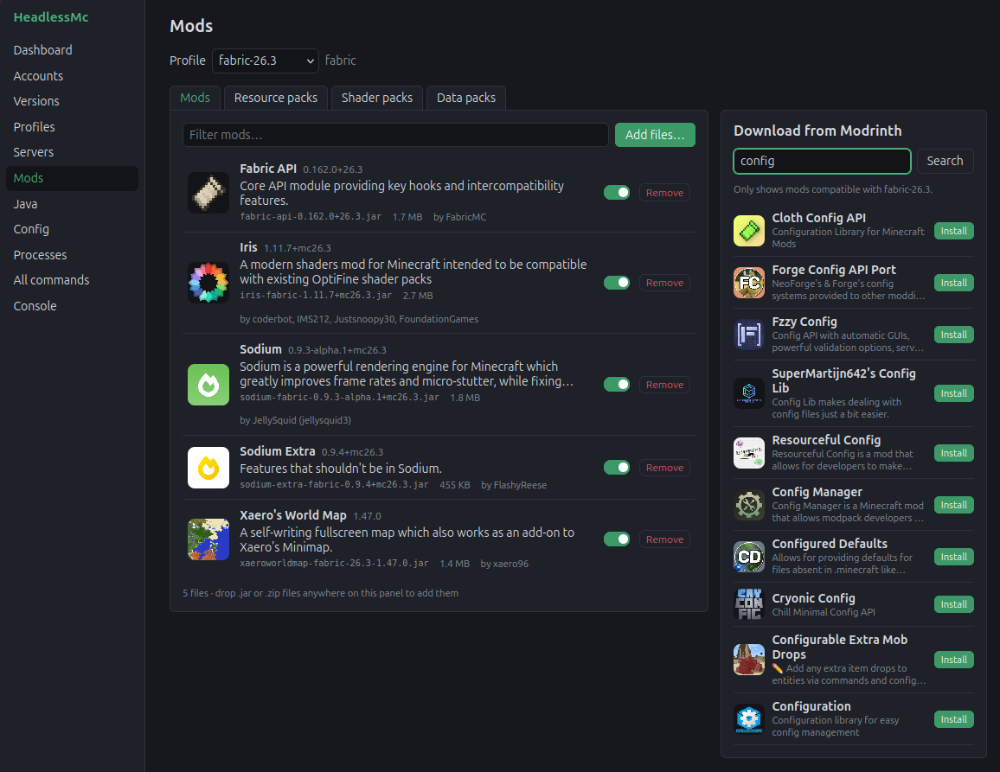

# HeadlessMc Web

> [!WARNING]
> This is work in progress and currently more of a demo.

A web GUI for [HeadlessMc](https://github.com/headlesshq/headlessmc).



## Getting started

```shell
git clone --recurse-submodules https://github.com/headlesshq/headlessmc-web.git

cd src/main/webui && npm install && cd -
./gradlew quarkusDev
```
